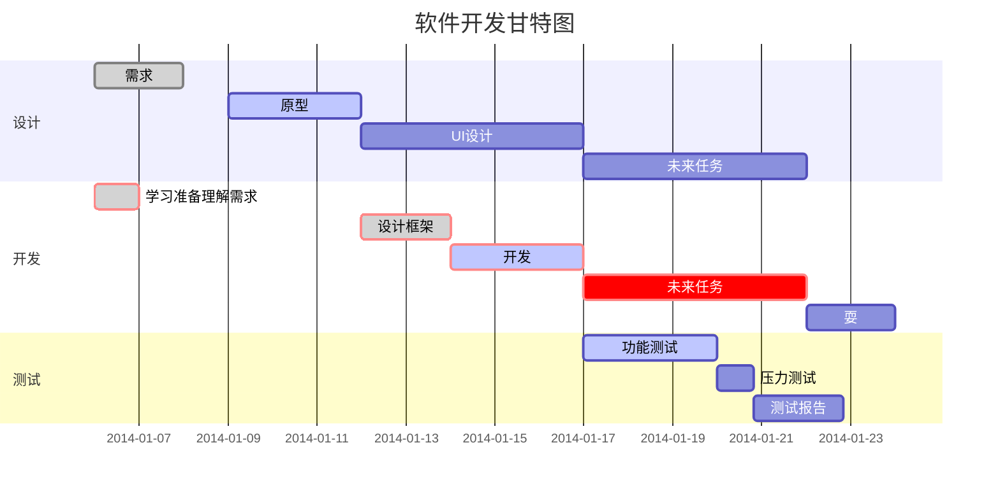

# 1. 标题

使用标题时，有两种方式。

## 1.1. 简便方式

### 1.1.1 一级标题

```
可以采用单行==，上一行为一级标题。
```

### 1.1.2 二级标题

```
可以采用单行--，上一行为二级标题。
```

## 1.2 常用方式

```
#				一级标题
## 			    二级标题
###			    三级标题
####		    四级标题
#####		    五级标题
######	        六级标题
```

# 2. 段落

## 2.1 回车

在MarkDown文本编辑中，到文档显示边界后会自动换行，同样也可以手动添加换行。

```
[空格][空格]回车
```

## 2.2. 字体

### 2.2.1 _斜体_

```
_斜体字_
*斜体*
```

### 2.2.2 __粗体__

```
__粗体__
**粗体**
```

### 2.2.3 ___粗斜体___

```
___粗斜体___
***粗斜体***
```

## 2.3 分割线


分割线如下图所示效果，需要行内不能有除分割线标识符的其他内容。

***

```
***

* * *

*****

- - -

----------

注：采用* - 均可，三个字符就可以。
```

## 2.4. 文本辅助内容

### 2.4.1 ~~文本删除线~~

```
~~文本删除线~~
```

### 2.4.2 <u>下划线</u>

```
<u>下划线</u>
```

### 2.4.3 脚注

脚注[^脚注]

[^脚注]:脚注内容，鼠标在脚注悬浮时候显示此对话，一般在文档最下方即可。

```
创建脚注格式类似这样 [^脚注]。

[^脚注]:脚注
```

# 3. 列表

## 3.1 无序列表

- 第一项
- 第二项
- 第三项

```
+ 第一项
- 第二项
* 第三项

注：采用+ - * 均可。
```

## 3.2 有序列表

1. 第一项
2. 第二项
3. 第三项

```
1. 第一项
2. 第二项
3. 第三项

注：序号后面有空格。
```

## 3.3 列表嵌套

1. 父项一：
   - 第一项
   - 第二项
2. 父项二：
   - 第一项
   - 第二项

```
1. 父项一：
    - 第一项
    - 第一项
2. 第二项：
    - 第二项
    - 第二项
```

# 4. 区块

> 最外层
>
> > 第一层嵌套
> >
> > > 第二层嵌套

```
> 最外层
> > 第一层嵌套
> > > 第二层嵌套
```

# 5. 代码块

## 5.1 代码


`System.out.pritnln` 代码

```
`System.out.println` 代码
```

## 5.2 代码块

```
此处是代码块。
```

```
​```代码块中的语言
此处是代码块
​```

注：MarkDown会根据关键字高亮显示。
```

# 6. 链接

## 6.1直接用链接

<http://www.baidu.com>

```
<http://www.baidu.com>
```

## 6.2给名字挂上链接

[百度](http://www.baidu.com)

```
[百度](http://www.baidu.com)
```

## 6.3给名字挂上链接，并在文章底部标明链接

[百度][baidu]

[baidu]:http://www.baidu.com

```
[百度][baidu]
[baidu]:http://www.baidu.com
```

# 7. 图片


```

```

# 8. 表格

|  ----  |  ----  |
| :----: | :----: |
| 表内容 | 表内容 |

```
|表头|表头|
|---|---|
|表内容|表内容|
```

# 9. 扩展


